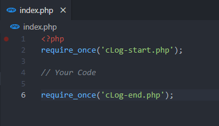

# cLog_php 1.0

**Projet:** Créer une console php, pour faciliter le développement et les tests en php.

[Lien vers le projet](https://tanguy-jpg.github.io/cLog_php/)

## Use

Pour utiliser la console, ajoutez au début de votre **fichier PHP**, en prenant exemple sur l'image ci-dessous :

```diff
require_once('cLog-start.php');
```
La fonction à utiliser pour afficher une variable dans la console est:
```diff
cLog('votre élément');
```


Puis ajoutez à la fin du fichier:

```diff
require_once('cLog-end.php');
```

Assurez vous que les fichiers **cLog-start.php** et **cLog-end.php** soient dans le même dossier que le fichier sur lequel vous souhaitez utiliser *"cLog"*
#### Render


## Download




[Lien de téléchargement (zip)](https://drive.google.com/uc?export=download&id=1hRqaAY6LeXGwYvmjFQTQSeTwpZNO5qMh)

[Lien de téléchargement (rar)](https://drive.google.com/uc?export=download&id=1fCA9XAhLPebVBlZMLEsf71czkF_3D3ZL)

