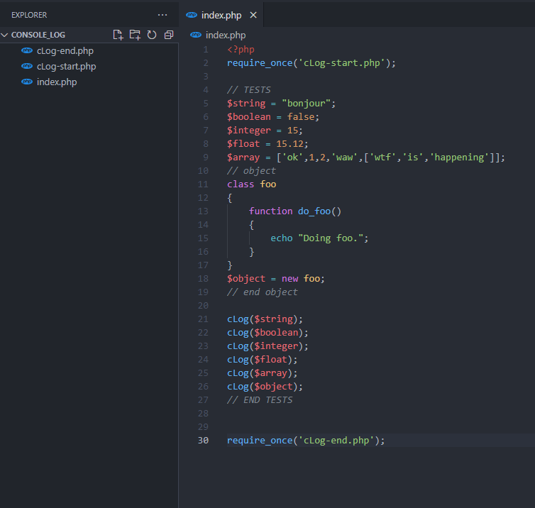

# cLog_php 1.0

*Projet:* Créer une console php, pour faciliter le développement et les tests en php.

[Lien vers le projet](https://tanguy-jpg.github.io/cLog_php/)

## Use

Pour utiliser la console, ajoutez au début de votre *fichier PHP*, en prenant exemple sur l'image ci-dessous :

```diff
require_once('cLog-start.php');
```



Ajoutez à la fin du fichier

```diff
require_once('cLog-end.php');
```
#### Render


## Download

[Lien de téléchargement](https://drive.google.com/uc?export=download&id=1fCA9XAhLPebVBlZMLEsf71czkF_3D3ZL)


